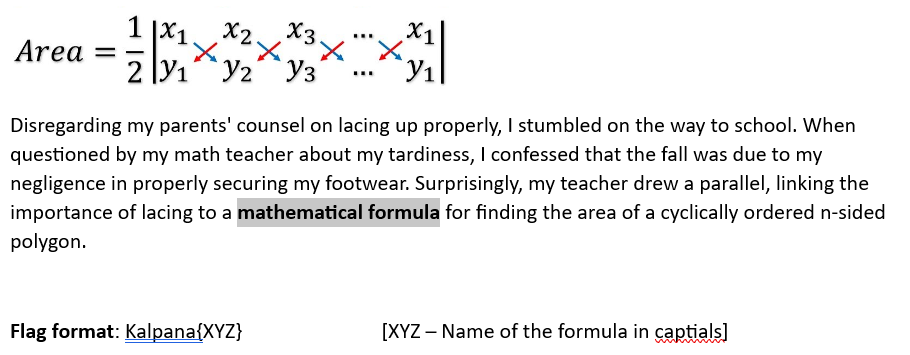

## Formula 

#### Difficulty level: Easy
#### Points: 50

**Shoelace formula** - is a mathematical algorithm to determine the area of a simple polygon whose vertices are described by their Cartesian coordinates in the plane.It is called the shoelace formula because of the constant cross-multiplying for the coordinates making up the polygon, like threading shoelaces.

Flag: Kalpana{SHOELACE}
