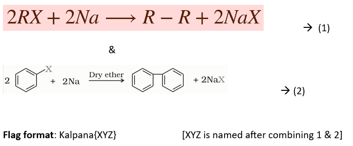

## MixMe
#### Difficulty level: Easy
#### Points: 50

The first reaction is called Wurtz reaction
The second reaction is called Fittig reaction
Based on these 2 chemical reactions, there is the rise of a new reaction called Wurtz-Fittig reaction.

**Wurtz-Fittig reaction** - A mixture of an alkyl halide and aryl halide gives an alkylarene when treated with sodium in dry ether and is called Wurtz-Fittig reaction.

Flag: Kalpana{WURTZ-FITTIG}