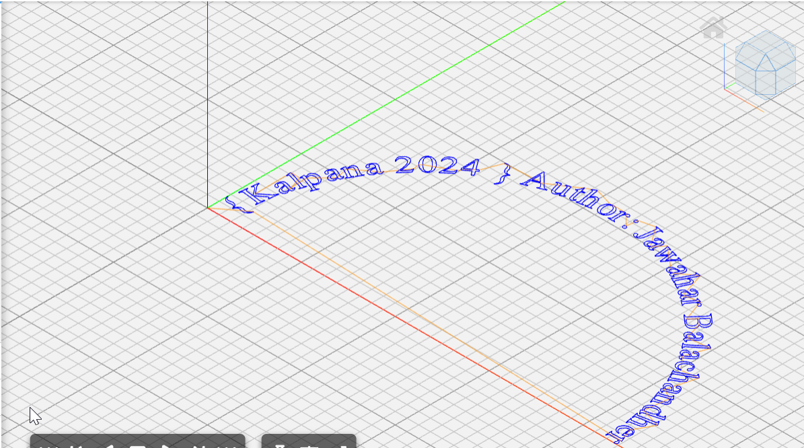

## CNC-machine
#### Author: Jawahar Balachandher
#### Difficulty level: Hard
#### Points: 200

Upon analyzing CNC-machine.txt file, we can see it is written in **Gcode**.

G-code (also RS-274) is the most widely used computer numerical control (CNC) and 3D printing programming language. It is used mainly in computer-aided manufacturing (CAD) to control automated machine tools, as well as for 3D-printer slicer applications. 

G here stands for Geometry

Now, go to https://ncviewer.com/ and paste the gcode and click on plot

Here, we can find the content present with the curly brackets - Kalpana 2024

Flag format asked in question: Kalpana{Name_YYYY}
Here Name and YYYY is the name and year present in curly brackets 

Flag: Kalpana{Kalpana_2024}