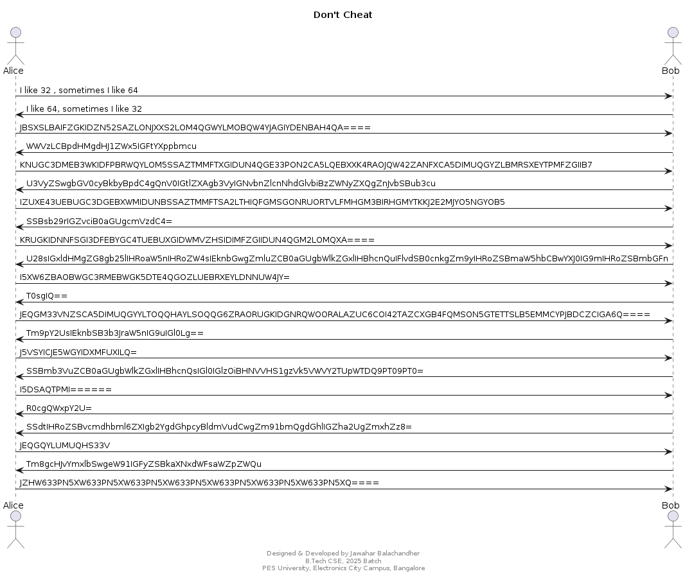
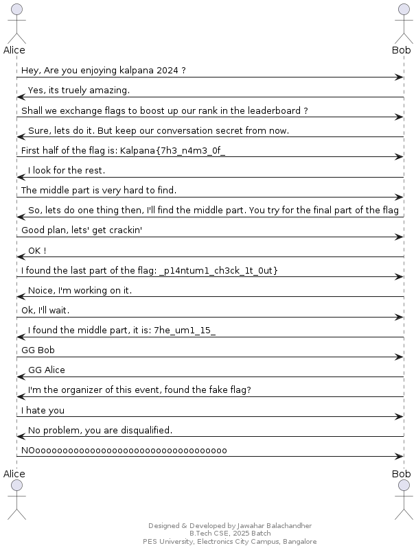

## Source
#### Author: Jawahar Balachandher
#### Difficulty level: Medium
#### Points: 100

Upon analyzing this source code, we can find its a plantuml code and its a conversation between Alice and Bob.

The hint for decrypting the entire conversation is given in the first coversation given by Alice and Bob
Alice -> Bob: I like 32 , sometimes I like 64
Bob -> Alice: I like 64, sometimes I like 32

So, **Alice** uses base32 for encrytion of her whole messsage and within this message she uses base64 to hide the part of the flag that she got.

**Example**: 
Alice -> Bob: IZUXE43UEBUGC3DGEBXWMIDUNBSSAZTMMFTSA2LTHIQFGMSGONRUORTVLFMHGM3BIRHGMYTKKJ2E2MJYO5NGYOB5

After using base32 decryption we get

First half of the flag is: S2FscGFuYXs3aDNfbjRtM18wZl8=

Now decrypt the encrypted part using base64, we get

Kalpana{7h3_n4m3_0f_

**Bob** uses base64 for encrytion of his whole messsage and within this message he uses base32 to hide the part of the flag that he got.

**Example**: 
Bob -> Alice: SSBmb3VuZCB0aGUgbWlkZGxlIHBhcnQsIGl0IGlzOiBHNVVHS1gzVk5VWVY2TUpWTDQ9PT09PT0=

After using base64 decryption we get

I found the middle part, it is: G5UGKX3VNUYV6MJVL4======

Now decrypt the encrypted part using base32, we get

7he_um1_15_

Result of decrypted conversation:

Final Flag:

Kalpana{7h3_n4m3_0f_7he_um1_15__pl4ntum1_ch3ck_1t_0ut}

References: 

https://plantuml.com/