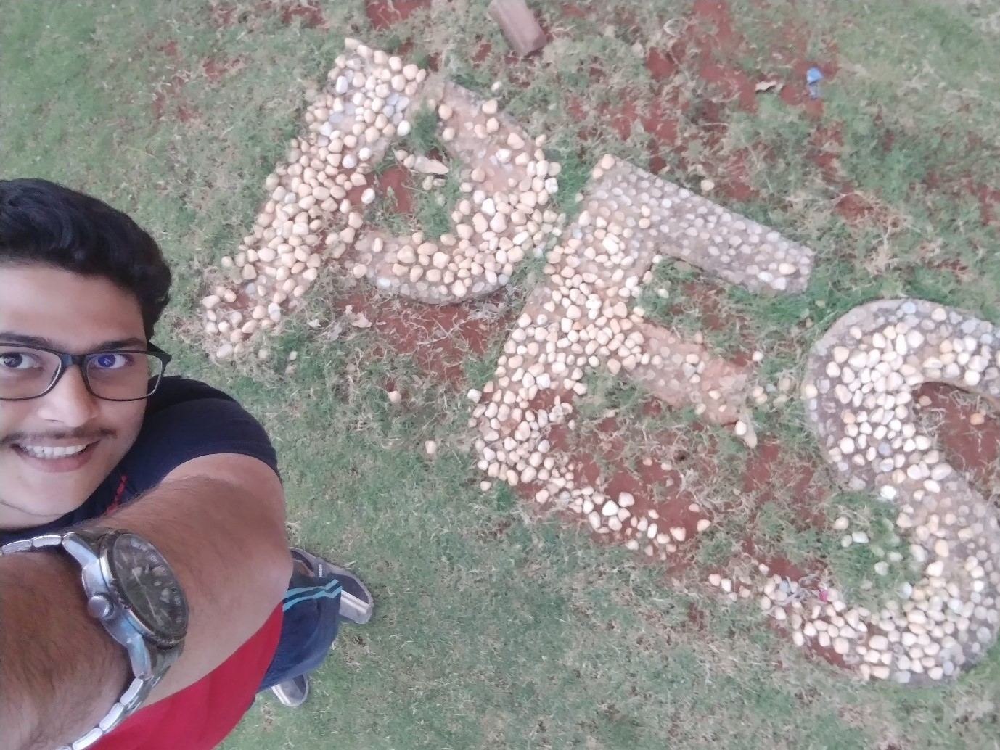

## Selfie
#### Difficulty level: Medium
#### Points: 100
#### Author: Jawahar Balachandher



Step-1: Use exiftool on selfie.jpg
        ```bash
        exiftool selfie.jpg
        ```

In the comment, you can find this hint for the passphrase
Passphrase: Name the block in EC campus where this artwork is present outside it. (full name in lowercase)

The answer to the passphrase: mechanical

Step-2: Use steghide to extract the information from selfie.jpg
        ```bash
        steghide --extract -sf selfie.jpg
        ```
After applying **mechanical** as passphrase, we can find a file called **found.txt**

found.txt contains the following content:

After spinning in the giant wheel FOUR times, CAESAR got down and blabbered something. I can't understand it. Can you?

VmtjeFUyUnRUWGxWYm1oaFUwaE9ORlp1Y0ZkYWF6RkhZVVpvVDFaRldrbFVWRVUxVlZVd2QxZHJlRmxOUmxwUlZGVldZVlF4WjNkWGEzaE9UVVp3VUZkSWNFZFhSbWcyVVd4c1YwMVViRmxVVlZacVRVWkdkVTFFTUQwPQ==

Upon reading the contents of the file we can find hints like FOUR and CAESAR, and the content is encrypted using base64

Step-3: After decrypting this content for 4 times using https://www.base64decode.org/, we get this output

Ndosdqd{1W5_0XW51G3_P3FK_EO0FN_FK3FN_1W_0XW_W0G4B}

Step-4: Apply caesar cipher using https://www.dcode.fr/caesar-cipher to get the flag

Kalpana{1T5_0UT51D3_M3CH_BL0CK_CH3CK_1T_0UT_T0D4Y}